# TQA Discovery Console

A live capture instrument for the business analyst running a client process walkthrough.

Capture at conversation speed without breaking eye contact, see what is still missing while
the client is still on the call, and leave with the evidence already arranged the way the
Velera Process Definition Document asks for it.

## Live preview

- **PREVIEW SITE** — [Console Live Preview](https://vgarcan.github.io/tqa-discovery-console)

- **DEMO FILES** - [Download Arch Return](assets/data/demo-session-ach-returns.json) and [Download Stress Session 01](assets/data/stress-session-wire-callbacks.json)
---

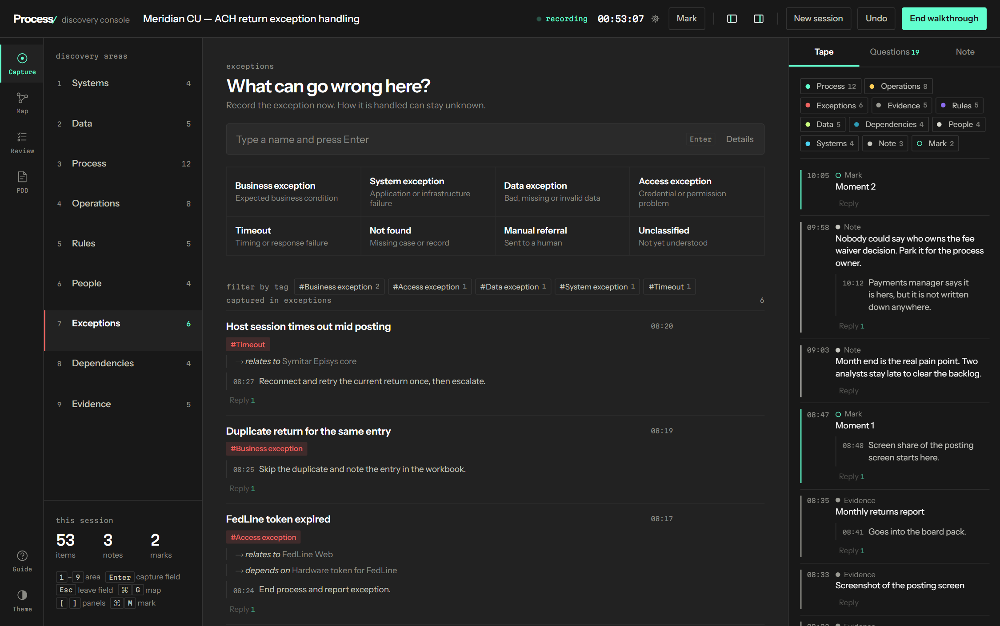

---

## Why it exists

A discovery session produces a flood of facts in no particular order. A system name, a
volume, an exception, a person, all inside ninety seconds. The usual tools force a choice:
type fast into an unstructured page and lose the structure, or fill in a template and lose
the conversation.

This tool removes the choice. Everything is typed into one field. The structure comes from
which of nine areas you are in, and that is one keystroke away. Nothing else interrupts.

Three things follow from a capture that is structured as it happens:

- The console can tell you, live, what you have not asked about yet.
- Facts can be linked to each other, so a map of the process exists before anyone draws one.
- The PDD draft writes itself from what you captured, with every unconfirmed field marked
  `TBC` rather than guessed.

---

## Getting started

Open `index.html` in a browser. No server, no install, no build step.

Everything lives in the browser's own storage, so a session survives a refresh, a crash and
the end of the day. Nothing leaves the machine unless you export it.

To try it with real content before a live call, import the sample session:

1. Go to the **PDD** or **Review** view and press **Import JSON**.
2. Drop `assets/data/demo-session-ach-returns.json` on the drop zone.
3. Press **Replace**.

That loads an invented ACH returns process with 53 items, 21 relations, threads, notes and
half the control questions answered, which is roughly what a first walkthrough leaves you.

`assets/data/stress-session-wire-callbacks.json` is the other one, and it is not a demo. It is
an invented wire-callback process built to break things: 58 items using every tag in the
vocabulary, 41 relations, replies carrying pipes and newlines, markup characters in names, an
item naming an area that does not exist, tags that are a string instead of an array, a relation
pointing at nothing, and three junk entries in `resolved`. Import it and the PDD should read
**103 of 112** with **38** by-hand fields and exactly nine open TBCs. Anything else means a
regression. `tests/audit.test.js` drives it and names the finding each assertion guards.

---

## Using it in a session

### The nine areas

The left panel is the structure. Each area asks one question, and the numbers `1` to `9`
move between them.

| | Area | The question it asks |
| --- | --- | --- |
| 1 | Systems | What system just appeared? |
| 2 | Data | What input or output just appeared? |
| 3 | Process | What did you just learn about the flow? |
| 4 | Operations | What operational fact just appeared? |
| 5 | Rules | What rule or decision appeared? |
| 6 | People | Who just became relevant? |
| 7 | Exceptions | What can go wrong here? |
| 8 | Dependencies | What does this depend on? |
| 9 | Evidence | What evidence did you get? |

The thin bar under each area is its coverage meter. It measures answered control questions,
not item count, so an area with ten items and no confirmations stays almost empty. That is
the point: it shows where you have been talking rather than asking.

### Capturing

Type a name, press `Enter`. That is the whole interaction.

Clicking a type first (Web UI, Business exception, Frequency) seeds the item with that tag
and changes the placeholder to a matching example. You can also just start typing a type
name: the field suggests matches across all nine areas, so `excep` from the Systems area
offers the exception types without you leaving.

Press `Details` only when an item needs tags or relations right away. Usually it does not,
and you do that after the call.

### Keyboard

| Key | Does |
| --- | --- |
| `1`–`9` | Switch area. Never steals focus, so you can walk the areas with the number row |
| `Enter` | Jump into the capture field |
| `Esc` | Leave the capture field, back to navigation |
| `⌘/Ctrl + Enter` | Save what you typed as a parked note instead of an item |
| `⌘/Ctrl + M` | Mark this moment, for finding it in the recording later |
| `⌘/Ctrl + G` | Open and close the relationship map |
| `[` `]` | Collapse the areas panel and the inspector |

Both side panels, and both panels in the map, resize by dragging their inner edge. The
cursor turns into a resize handle a few pixels either side of the border. Double-click the
edge to go back to the default width, or focus it with `Tab` and use `←` `→` (`Shift` for
larger steps, `Home` to reset). Widths are saved with the session, and are re-clamped if the
window gets too narrow to hold them, so the capture surface never disappears.

### The inspector

Three tabs on the right, one at a time.

**Tape** is everything you captured, newest first, colour coded by area. Marks use a ring
instead of a filled dot. The chips at the top filter by kind, so one click gets you just the
notes, or just the exceptions.

Every entry can be replied to. A reply is a follow-up on that specific fact, and the thread
stays attached to it everywhere: the tape, the item list, the review, the export.

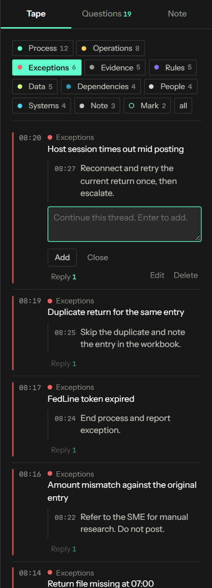

**Questions** is the console telling you what is still missing, generated from what you have
already captured. Tick one when the client confirms it, and the area meter moves.

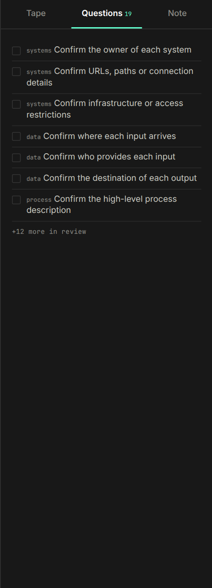

**Note** parks anything you have no time to classify.

### Tags as filters

Tags are free-form. Type `programx` or `sme` in the detail sheet and it becomes a filter
everywhere. On the stage, the chip row under the types narrows the list of the current area.

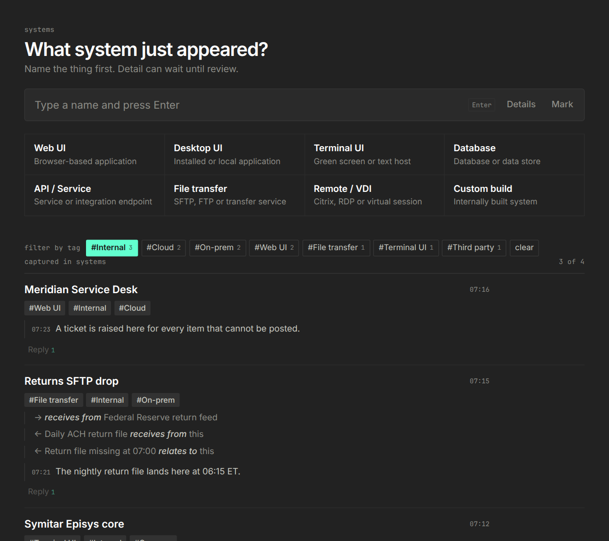

---

## The relationship map

`⌘/Ctrl + G`, or the Map icon. Every item is a node, every relation is an edge, node size
grows with how connected a thing is, and colour is the area.

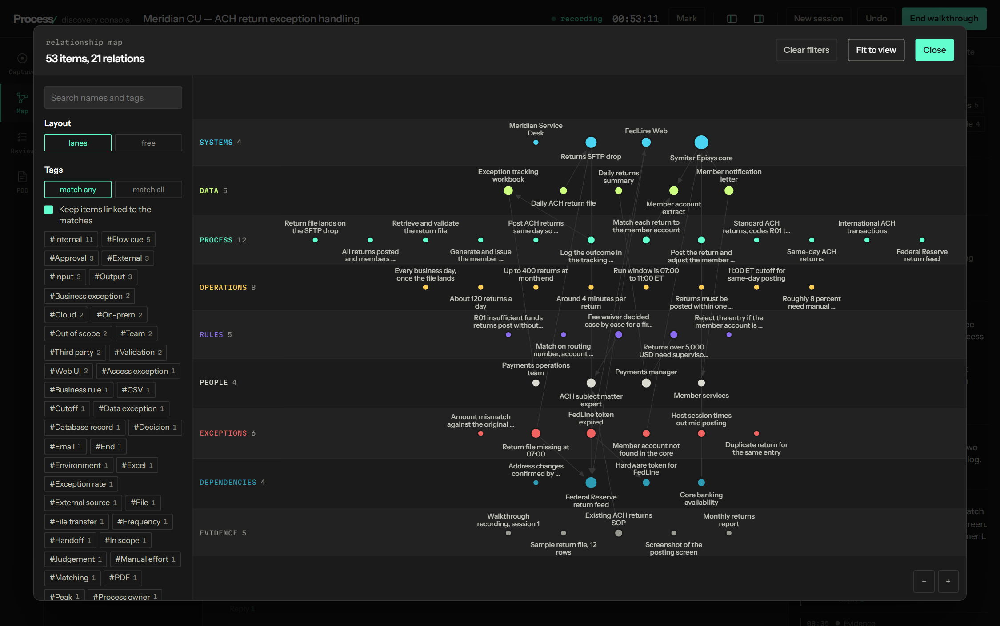

The left panel filters. Pick `#sme` and only the SMEs remain. Pick two tags and choose
whether an item must match **any** or **all** of them. The areas legend switches whole
layers off.

**Keep items linked to the matches** is the one that earns its keep. Filter by
`#Third party` and you get the third-party dependencies plus, dimmed, everything that hangs
off them, which in the sample session is two exceptions and the system they arrive through.

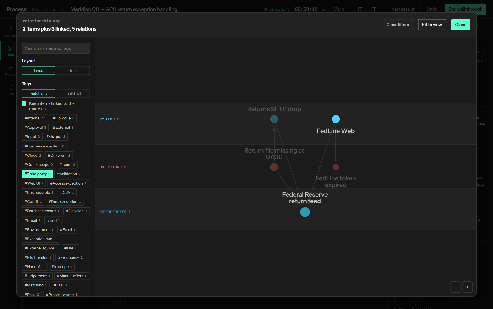

Select a node and the right panel opens. From there you pick a relation type, tick several
items at once and create all those links in one go. Relations read in both directions: each
item shows what it points at and what points at it.

Drag nodes, scroll to zoom, drag the background to pan, **Fit to view** to recentre.

---

## After the call

### Review

What you have, what is still open, and how much of the PDD each section can support.

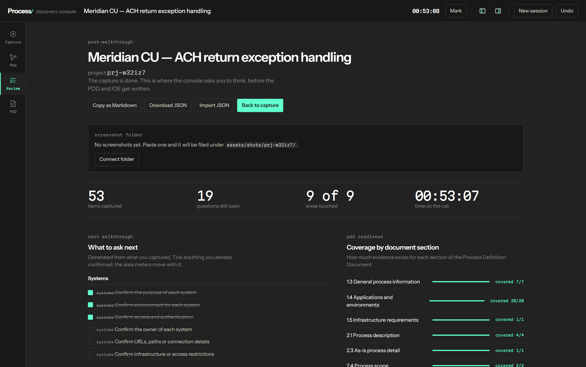

The open questions are tickable here too, grouped by area, so a five-minute post-call pass
turns a vague sense of "we covered most of it" into a list you can send the client.

The coverage bars measure how much of each PDD section the evidence actually fills, section
by section, and show the fraction. A section reading `not landing 1/4` has items captured
against it that are not reaching any field — usually a missing tag or a missing reply.

### The PDD draft

The **PDD** view arranges everything into the approved Velera template: sections 1.1 through
2.10, tables where the template has tables, lists where it has lists.

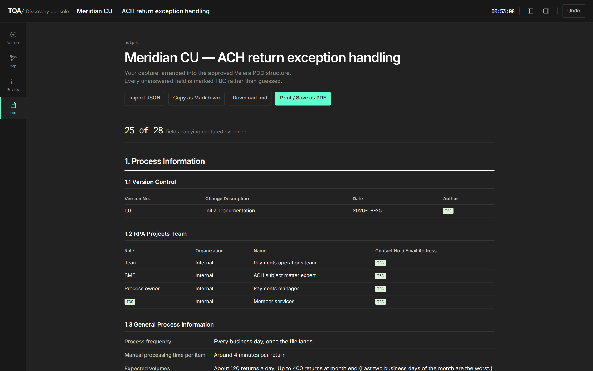

Two rules govern it.

**Nothing is invented.** Any field without evidence behind it is marked `TBC` in the
template's soft green. Sign Off is left blank on purpose rather than marked `TBC`.

A `TBC` in a dashed outline is a different animal: the console has no field that could
ever carry it, so no amount of asking will fill it. Contact details, Access Granted, the
Location/Owner/Provider of each input — those are yours to type in by hand, and the header
counts them separately from the ones still worth chasing. In the Markdown export they read
`TBC (by hand)`.

The header reads *93 of 94 fields carrying captured evidence* on the sample session, and it
counts one cell at a time. A table with one system name and sixteen blanks does not score as
a filled table.

**Replies become the long-form answers.** The first reply on an item fills the field that
needs a sentence rather than a name. Reply to an exception with "Report to the SME team and
continue process" and it lands in the Process/Business Action column. Reply to an input and
it becomes the Description.

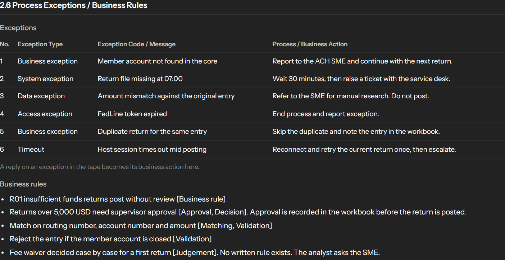

Outputs: **Copy as Markdown**, **Download .md**, and **Print / Save as PDF**, which uses a
separate black-on-white stylesheet.

### Session files

**Download JSON** in Review saves the whole session, named from the process and the date.
**Import JSON** loads one back, by file picker or drag and drop, with a summary shown before
anything is touched.

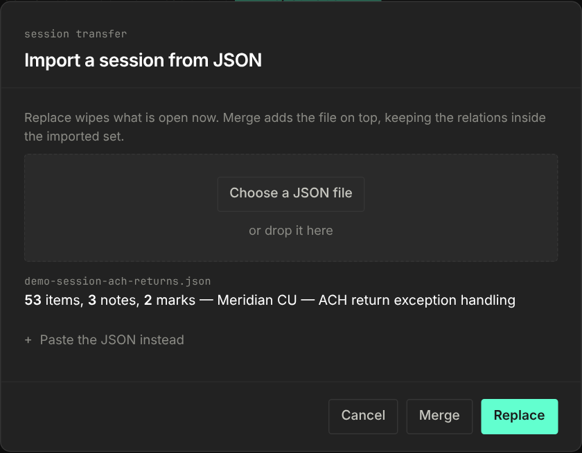

**Replace** swaps the open session, and asks once before it does. **Merge** adds the file on
top of what you have, reassigning ids and rewriting relation targets inside the imported set,
so two analysts' sessions can be joined without collisions. An item naming an area the console
does not have is parked in Systems rather than silently vanishing, and the toast says how many.

### Deleting

Deleting an item, a reply or a relation takes two presses. The first turns the button red and
relabels it; the second does the work. A double-click cannot get through both, and anything
else you click, or `Esc`, calls it off. Nothing here has an undo, which is why.

### Light theme and focus mode

`[` and `]` collapse both panels down to the capture surface. The theme button switches
between the dark console and a light one that follows the TQA rule of red accents on light
backgrounds.

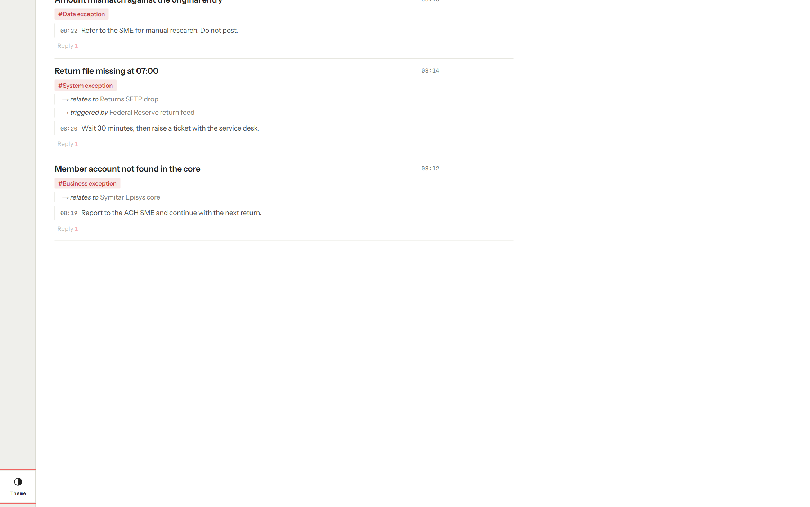

---

## Project layout

```
index.html                  dev entry, and the single source of truth for load order
tools/build.py              bundles everything into one self-contained file
tools/audit.py              module dependency graph and capture vocabulary, fails on drift
tools/screenshots.py        regenerates the images in this README
tests/audit.test.js         110 functional checks against the built bundle
dist/                       the bundle that gets published
docs/images/                README screenshots
assets/data/                the demo session and the stress fixture
src/css/                    styles, one file per responsibility
src/js/                     behaviour, one file per responsibility
```

### Building

```
python3 tools/build.py          # writes dist/tqa-discovery-console.html
python3 tools/build.py --check  # fails if dist is behind the sources
```

A published Claude Artifact has to be one self-contained file, so `dist/` is what gets
published while `index.html` is what you work in. `build.py` reads the `<link>` and
`<script src>` tags between the `<!-- build:css -->` and `<!-- build:js -->` markers in
`index.html` and inlines them in that order. To add a module, drop the file in `src/` and add
its tag to `index.html`; nothing else knows the file list.

### Checks

```
python3 tools/build.py --check          # dist is in step with the sources
python3 tools/audit.py                  # dependency graph and capture vocabulary, fails on drift
node tests/audit.test.js                # 110 functional checks against dist
```

`tests/audit.test.js` needs jsdom (`npm install jsdom`, or run with
`NODE_PATH=<path to node_modules>`). It drives the built bundle through the same listeners a
person would trigger: capture, keyboard navigation, threads, gaps, relations, the map,
review, the PDD draft, JSON import and export, persistence, legacy-session migration and both
themes. It fails on any uncaught page error, so run it before publishing.

The last groups drive `assets/data/stress-session-wire-callbacks.json` through replace, the PDD,
the Markdown export and a merge, asserting the exact numbers that file is built to produce. They
exist because the demo session cannot catch a whole class of problem: it was tagged through the
detail sheet, so it never exercised what the capture grid actually stores.

### Screenshots

```
pip install playwright && playwright install chromium
python3 tools/screenshots.py
```

The app loads Instrument Sans and Martian Mono from Google Fonts. On a machine that cannot
reach `fonts.googleapis.com`, Chromium falls back to whatever is installed and the images
will not match the published app unless you alias the two families to local substitutes.

---

## Load order matters

Both stylesheets and scripts are numbered because they are concatenated in that order.

For CSS the numbering is the cascade. `08-shell.css` deliberately overrides parts of
`03-capture.css`, so it has to come after it. Renaming a file to change its position changes
the rendered layout.

For JS the numbering is execution order. The modules share a global scope on purpose rather
than using ES modules, so the whole thing still runs from `file://` with no tooling.
`19-boot.js` is the only module that calls anything at load time; every other module defines
functions and attaches listeners.

Three rules keep the boundaries honest, and `tools/audit.py` fails if any of them breaks:

- `01-model.js` depends on nothing. Everything the tool knows about discovery areas, types,
  tags and gap rules lives there and nowhere else.
- Every capture type resolves to a tag its area declares. An action is `[label, description]`,
  or `[label, description, tag]` when the button's label is not the tag to store — `Average
  volume` stores `Volume`. The PDD looks tags up, so a label that is not a declared tag renders
  the field `TBC` on a live capture while the sample session fills it.
- Anything that changes the session calls `renderAll()` from `18-render.js`. No module
  repaints the whole app itself, so a change to one view cannot silently skip another.

### Styles

| File | Covers |
| --- | --- |
| `01-tokens.css` | Design tokens, light and dark themes, resets, shared typography |
| `02-topbar.css` | Brand, session name, clock, panel toggles |
| `03-capture.css` | Area rail, capture bar, type grid, item list |
| `04-review.css` | Review stats, coverage bars, inventory |
| `05-sheet.css` | Item detail sheet and toast |
| `06-tags.css` | Tag filter chips, shared by the stage and the map |
| `07-map.css` | Map window: filters, graph, detail panel |
| `08-shell.css` | Icon bar, collapsible nav panel, resize handles, tabbed inspector |
| `09-tape.css` | Tape colour coding, kind filter, reply threads |
| `10-pdd.css` | PDD draft document and the print stylesheet |
| `11-transfer.css` | Import drop zone and paste fallback |

### Behaviour

| File | Covers |
| --- | --- |
| `01-model.js` | The nine areas, their types and tags, gap rules, PDD coverage map. No DOM, no state |
| `02-state.js` | Session state, localStorage with migration, shared helpers, toast |
| `03-areas.js` | Channel strips, coverage meters, area switching, quick-type grid |
| `04-capture.js` | Capture bar and cross-area type-ahead |
| `05-items.js` | Captured-item list, relations shown in both directions |
| `06-tape.js` | Chronological tape, colour coding, kind filter, reply threads |
| `07-gaps.js` | What is still unconfirmed, and resolving it |
| `08-notes.js` | Parked notes, marked moments, undo, session name |
| `09-sheet.js` | Detail sheet: tags and the many-to-many relation editor |
| `10-review.js` | Post-walkthrough review |
| `11-export.js` | Session Markdown and clipboard |
| `12-settings.js` | Theme, global shortcuts, session clock |
| `13-tags.js` | Stage tag filtering, area colours, incoming-relation lookup |
| `14-map.js` | Map filtering, force layout, rendering, interaction, linking |
| `15-shell.js` | View switching, collapsible and resizable panels, inspector tabs |
| `16-pdd.js` | Maps captured evidence onto the approved PDD template and exports it |
| `17-transfer.js` | JSON import by file or paste, file saving via the downloads capability |
| `18-render.js` | The single repaint orchestrator |
| `19-boot.js` | Start-up only: restore, apply saved shell state, draw the first frame |

### Where to make a change

| Change | File |
| --- | --- |
| New area, capture type or tag | `01-model.js` |
| New control question | `01-model.js`, the `GAPS` block |
| The PDD template changed | `16-pdd.js` |
| How the map looks or behaves | `14-map.js`, `07-map.css` |
| JSON format or import rules | `17-transfer.js` |
| Brand colours or typography | `01-tokens.css` |

---

## Data model

One session object, persisted under the localStorage key `tqa.discovery.console.v1` and
exportable as JSON.

```jsonc
{
  "name": "Meridian CU — ACH return exception handling",
  "active": "Exceptions",
  "seconds": 4680,
  "items": [
    {
      "id": "d00",
      "section": "Systems",              // one of the nine areas
      "name": "Symitar Episys core",
      "tags": ["Terminal UI", "Internal"],
      "relations": [{ "type": "reads from", "targetId": "d05" }],
      "replies": [{ "text": "...", "at": "07:16", "ts": 1758790847000 }],
      "at": "07:12",
      "ts": 1758790847000
    }
  ],
  "notes": [{ "id": "n1", "text": "...", "replies": [], "at": "08:22", "ts": 0 }],
  "marks": [{ "id": "m1", "at": "08:47", "seconds": 1860, "replies": [], "ts": 0 }],
  "resolved": ["Systems::Confirm the purpose of each system"]
}
```

Three things worth knowing:

- `relations` are directional but read both ways. An item shows what it points at and what
  points at it, and the map draws one edge per relation.
- `tags` hold the declared tag, not the capture button's label. `tagOf()` in `01-model.js` is
  the only place the two are reconciled.
- The first entry in `replies` is the long-form answer when the PDD draft is built.
- `resolved` holds `"Area::gap text"` keys. These drive the coverage meters, so they are the
  closest thing to a completeness score.

Older session files without ids, timestamps or reply arrays are migrated on load, so an
export from an earlier version still opens.

---

## Limits worth knowing

- Storage is per browser and per device. The JSON export is the only way to move a session
  or back it up.
- The force layout is comfortable to roughly a couple of hundred nodes. Past that, filter the
  map by tag rather than fighting the whole graph.
- The PDD draft is a draft. It assembles evidence into the right shape; it does not write the
  Process Description paragraph for you, and it should not.
